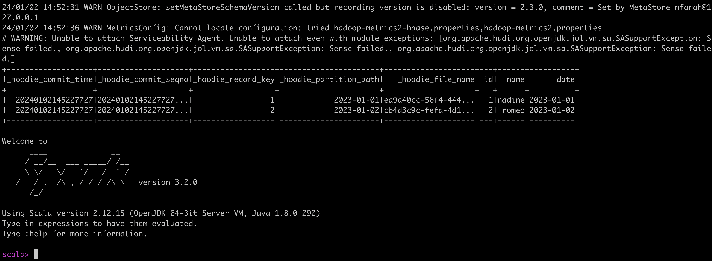

# Hudi Code Sample Overview
This code is a sample Scala script using Apache Hudi with Apache Spark. This is a simple script that demonstrates how to write and read data using Hudi on a copy-on-write (COW). Below is a breakdown of the key section

## What you need to execute the script
This script is being ran on Macbook pro with m1 max chip. You can run it on spark version 3.2, 3.3, or 3.4. I'm using 3.2. Make sure you have:
- Your spark version. I'm using this: [spark-3.2.0-bin-hadoop3.2](https://spark.apache.org/news/index.html)
- [Java 8](https://github.com/AdoptOpenJDK/homebrew-openjdk)
- Set your $SPARK_HOME in your profile


## To Run the script for Spark 3.2
```export SPARK_VERSION=3.2``` # change this number to your Spark version

``` $SPARK_HOME/bin/spark-shell --packages org.apache.hudi:hudi-spark$SPARK_VERSION-bundle_2.12:0.14.0 --conf 'spark.serializer=org.apache.spark.serializer.KryoSerializer' --conf 'spark.sql.catalog.spark_catalog=org.apache.spark.sql.hudi.catalog.HoodieCatalog' --conf 'spark.sql.extensions=org.apache.spark.sql.hudi.HoodieSparkSessionExtension' --conf 'spark.kryo.registrator=org.apache.spark.HoodieSparkKryoRegistrar' -i /path_to_code/hudi_code_sample_1.scala```


## Code Breakdown
1. **Spark Session Initialization with Hudi Support**:
   - **Lines 1-12**
    - Initializes a Spark session with necessary configurations for Hudi.
    - Sets the Spark serializer to `KryoSerializer` for better performance.
    - Enables Hudi in Spark SQL through the configuration `spark.sql.extensions`.

2. **Data Creation**:
   - **Lines 14-19**
    - Creates a mock dataset using a sequence of tuples (id, name, date).
    - Converts the sequence to a DataFrame (`df`).

3. **Hudi Table Configuration**:
   - **Lines 21-31**
   - Defines the name and base path for the Hudi table.
   - Configures options for the Hudi table, including keys and table type (`COPY_ON_WRITE`).

4. **Writing Data to Hudi Table**:
   - **Lines 33-37**
   - Writes the DataFrame to a Hudi table using the specified options.
   - Sets the write mode to `Append`, allowing new data to be added to the table.

5. **Reading Data from Hudi Table**:
   - **Lines 39-48**
   - Specifies read options, setting the query type to `snapshot` (providing a view of the latest committed dataset).
   - Reads from the Hudi table and stores the result in `hudiDf`.
   - Displays the contents of `hudiDf`.

   You should see the results of the snapshot query:
   

# Resources
Have questions? Join the [Apache Hudi Slack Community](https://join.slack.com/t/apache-hudi/shared_invite/zt-20r833rxh-627NWYDUyR8jRtMa2mZ~gg) and ask questions on the #general-hudi-questions

